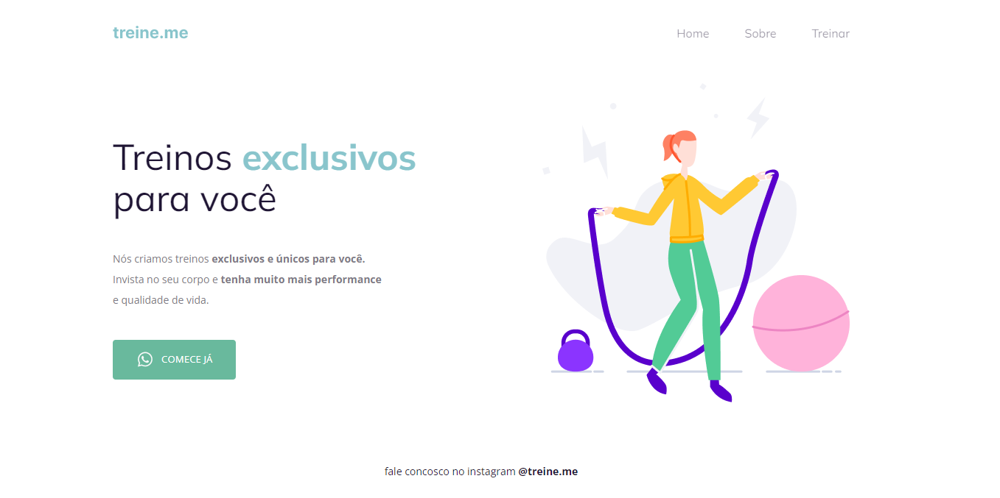

# Treine.me - Plataforma de treinamentos

Projeto 02 do programa Explorer da Rockeseat. 

 

## 🚀 Começando

Execultar index.html

### 📋 Pré-requisitos

Execultavel em qualquer navegador

### 🔧 Instalação

Não carece de instalação

## 📦 Desenvolvimento

É uma pagina HTML estilizada em CSS, aplicavel em qualquer sistema WEB

## 🛠️ Construído com

HTML 5 e CSS3

s
## 📌 Versão

Versão única

## ✒️ Autores

* **Paulo Victor Pinheiro** - *Trabalho Inicial* - [Paru - Paulo Victor](https://www.linkedin.com/in/paulo-pinheiro-4a94b0150/)

## 🎁 Expressões de gratidão

* Gratidão à equipe Rocketseat

---
⌨️ com ❤️ por [Paulo Victor](https://gist.github.com/Paru369) 😊
